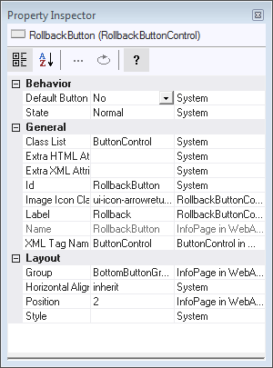

# The Property Inspector

The Property Inspector enables you to inspect and change the properties of the object within the current page that you have currently selected in the Object Tree.

The Property Inspector shows property names in the left-hand column and property values in the center column. The right-hand column shows the class where the setting was inherited from. If this column is empty, the setting has been made locally.

Property Inspector 

For the object currently selected in the active Preview Pane and Object Tree, open the Property Inspector from the View menu, from the context menu on the design window, or by clicking the Property Inspector icon on the toolbar.

- For windows, main queries, extra queries and query columns, open the Property Inspector from the Design menu.
- For the application, open the Property Inspector by choosing Edit Application from the File menu.

By default, properties are grouped vertically by category (eg. Behavior, General, Layout).

Near the top of the Property Inspector there is a toolbar, consisting of two sort order buttons, an Edit button, a Reset button and a button to display or hide the help area at the bottom of the Property Inspector pane.

The 2 sort buttons are used to determine how the properties must be sorted and presented in a vertical list.

In the central column of the Property Inspector, you can manually edit the value of the selected property. The Edit button may be available depending upon the property that is currently highlighted. If it is, and you press it, an appropriate dialog or utility will be opened to help you to compose a property value.

You can use the Reset button to erase a local property setting so that it returns to the value inherited from the object named in the right-hand column.

You can open multiple Property Inspectors on multiple objects, but only one Property Inspector can be active at any one time.

The Property Inspector can be "docked". As a dockable pane, it may:

- Be docked to the sides of your application.
- Float above your application in a separate window.
- Be collapsed to the side of your application, only appearing when the user moves the cursor over the Property Inspector's caption in the margin of the main window.