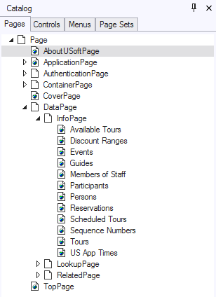

# The Web Designer catalog

The catalog appears by default on the left-hand side of the Web Designer tool interface.

 

The catalog may or may not be hidden. To show the Catalog, choose Catalog from the View Menu or press Cntr + F7. To hide the Catalog, click the Close button in the top-right corner of the catalog pane, or choose Hide Catalog from the context menu of most catalog tree nodes.

The catalog can be "docked". As a dockable pane, it may:

- Be docked to the sides of your application.
- Float above your application in a separate window.
- Be collapsed to the side of your application, only appearing when the user moves their cursor over the Catalog's caption in the margin of the main window.

The catalog shows Pages, Controls, Menus and Page Sets.

**Pages**

The Pages tab of the catalog lists Pages that show data from tables and columns, but also Pages that are not related to data. A Page is an object that you may or may not publish as part of your web finished web application.

The catalog does not just give a list of Pages. It also shows the inheritance hierarchy between Pages. If you make a change in one page, all its direct and indirect children take on this change.

Default Pages are pages that USoft automatically generates automatically for you on the basis of tables, columns and relationships that you defined in USoft Definer.

**Controls**

The Controls tab of the catalog shows a palette of objects and controls that you can insert in a Page and that the user can interact with.

**Menus**

The Menus tab of the catalog lists all the available menu pages for inclusion in the Web application. See "Web Menus" for more information.

**Page Sets**

The Page Sets tab of the catalog initially shows no content. When you start grouping Pages in Page Sets, it will begin to display how Page Sets contain Pages and/or other Page Sets. Page Sets are a practical help when you need to publish a group of interlined pages as a single action.