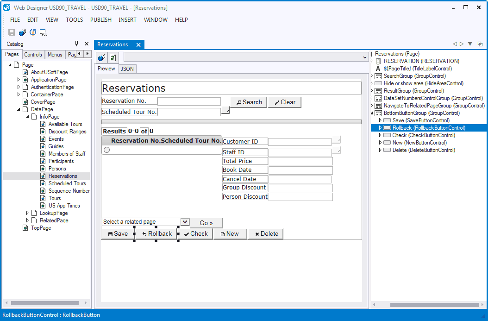

# The Web Designer tool interface

The example below shows three important elements in the Web Designer tool interface:

- The Catalog (on the left).
- The Preview pane (in the middle).
- The Object Tree (on the right).

Catalog, Preview Pane, Object Tree