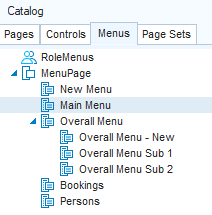

# Defining a menu

When you define a menu page, you specify the page itself, and the menu lines that present the options. Menu pages may contain sub menu pages. Existing Menu Pages are displayed on the Menus tab of the Catalog:



To define a menu page:

1. In the Menus tab of the catalog, select the top level MenuPage class, and from the right-click menu, choose New. A new menu page subclass is created. Rename the new subclass to an appropriate name. This will be the top page of your menu and you refer to this page in the Authorizer if you wish to work with authorized menus.

2. Double-click the new menu page class. The class will be opened in the preview pane.

3. In the preview pane, make sure that the Menu Page name is highlighted, then choose Menu Line or Menu Page (the latter if you want to insert a submenu) from the Insert menu. A new menu line or menu page will be inserted. Repeat these actions as many times as required to get the menu or menu structure that you want.

You can drag and drop an existing menu page from the Catalog onto the menu being built in the preview pane. The dragged menu page will then be displayed as a submenu.

You can delete menu lines or menu pages inherited from an inserted class if you do not want them in the menu page being built. To do this, right-click on the item and choose Delete. The deleted item will remain in the list in the design area, but will be marked with a large red cross to denote that it is not used.

You can undo the delete action by right-clicking on the item and choosing Undelete.

4. For each inserted Menu Line or Menu Page, call up the Property Inspector, using the right-click menu, and provide values for the properties in the Property Inspector's property list. Use the help in the bottom pane of the property Inspector for hints on setting the properties. If required, you can make local settings for menu lines inherited from a superclass of the menu page. A menu line often leads to a page. You can specify the name of the page class using the URI property, or specify any other navigable URL as a value of this property. Alternatively, you can leave the URI property empty and handle the navigation with java script:

```
$.udb.navigateTo(page, {targetFrame: <frame name>})
```

5. Save your changes.

## How to use images

To use an image in a web menu, set the Prompt property of the corresponding menu line to:

```

```

where "\<imagepath>" is the path to the image in question.

*Example*

```

```

## How to execute a JavaScript function

To execute a JavaScript function from a web menu, add the script to the Script property of the menu line concerned. You can also call your own functions that are defined in the js/CustScript.js file in your publication folder.

## How to include a non-clickable menu item

To include a non-clickable web menu item, add a menu line and set its Prompt property to:

```
<div> </div>
```

 