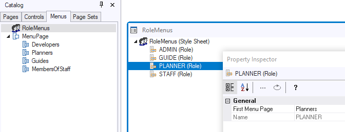
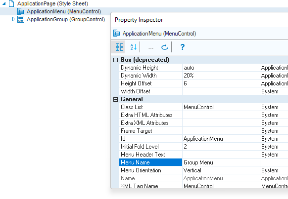

# Role-based web menus

This article explains the actions you must take to create a *role-based* or *role-dependent* initial web menu in your application. The initial menu is the menu displayed when a user logs on.

The effect of these actions is that, when logging on, users associated with different roles see different menus.

## Step 1: USoft Definer: Define roles

In USoft Definer, define different roles for different users. Different roles will also have different access rights.

## Step 2: Restart Web Designer

If you had Web Designer open, make sure to close it and then re-open it from the USoft Binder file. This way, Web Designer picks up the new roles that you defined in Step 1.

## Step 3: Define role-specific menus

In Web Designer, in the Menus tab of the Catalog, define a different initial menu for each role.

What is a suitable menu for a role? A good start is simply to look at the role’s *table rights*. In the menu, include a menu line for each table that the role has at least 1 table right for, but not to other tables.

## Step 4: Map roles to menus

In Web Designer, on the Menus tab of the Catalog, open the RoleMenus object. Set the **First Menu Page** property for each role to the initial menu you want for the role.

> [!TIP]
> This example shows a 1:1 mapping between menus and roles, but even better is to create a Master Menu with all the options, and then make subclasses in the menu catalog for the individual roles. This is best practice in many cases, because usually, what defines role-based access is that a role must be disallowed certain options, and it is easy to delete a menu line from a subclass menu. Why would you bother with a Master Menu?

## Step 5: Switch from default menu to role-based menus

Find out what is the StartPage of the Publication Configuration that you publish against. (The default StartPage is called ApplicationPage.)

Open this page class from the Pages tab of the Web Designer catalog.

In the Object Tree on the right, check that you have a MenuControl (if not, insert one). For the MenuControl, set **Menu Name** to **Group Menu**.

----

Prior to USoft 10.0.1K, at this point, you had to rename the Menu File property from **DefaultMenu.xml** to **Menus.xml**. This is no longer necessary. The Menu File property has been dropped.

----

## Step 6: Test

To test the result, in USoft Authorizer, run Fill Authorizer Tables for the application, so that USoft Authorizer picks up the new roles you defined in Step 1.

For each role, define a separate Application User, and make sure he is associated with the role.

> [!TIP]
> If you work with [merged roles](/docs/Authorisation%20and%20access/Introducing%20USoft%20authorisation/Merged%20roles.md), USoft will automatically attempt to compose an appropriate menu for users who hold multiple roles. But this is a next step. First, test your role-based menus simply with dummy test users, each of which is associated to only 1 role. This way, you can check that the role-based menus work properly, independently of any effect of role merge.

Make sure you re-start the Rules Service so that it picks up the new roles of Step 1.

In your browser, log on as the different users. Depending on who you log on as, you should now see the correct role-dependent initial menu.